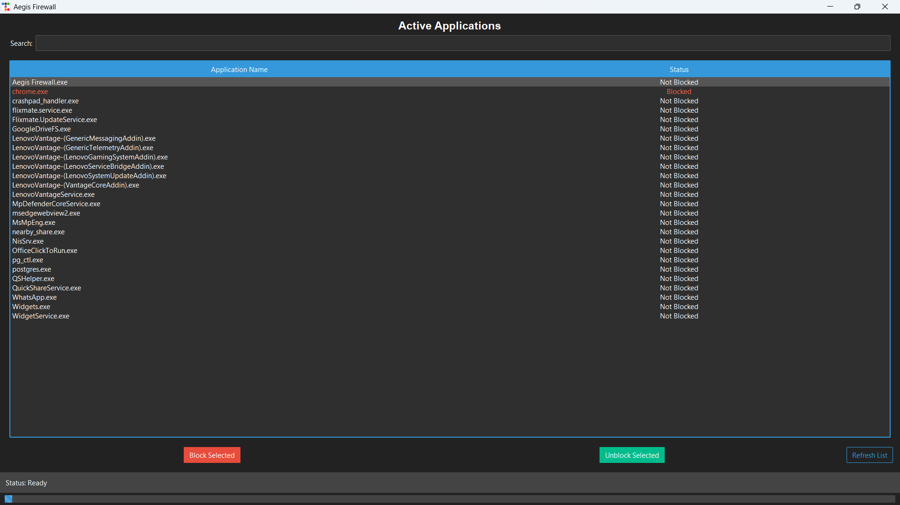
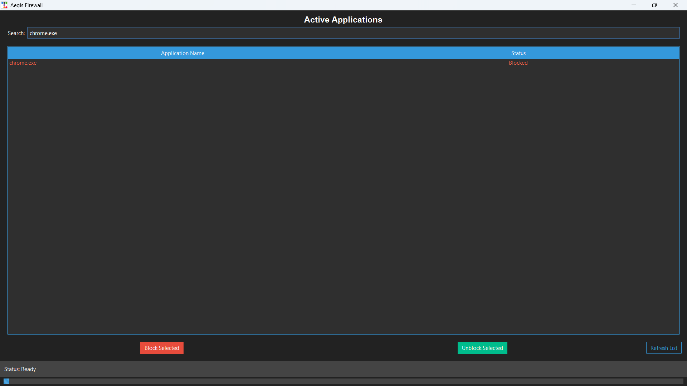

# 🛡️ Aegis Firewall

A modern, GUI-based Windows firewall controller built with **Python**, **Tkinter**, and **ttkbootstrap**.  
Easily **view, search, block, and unblock** applications from accessing the internet — all in a clean, stylish interface.

---

## 🚀 Features

- 🔍 **Real-time Search** — Quickly find running applications.
- 📜 **Application List** — View only user-installed apps (system processes filtered).
- 🛑 **One-Click Block/Unblock** — Manage firewall rules without touching the command line.
- 🎨 **Modern UI** — Powered by [ttkbootstrap](https://ttkbootstrap.readthedocs.io/).
- ⚡ **Multi-threaded** — Smooth performance without UI freezing.
- 💾 **Persistent Rules** — Uses Windows `netsh advfirewall` to apply permanent rules.

---

## 📸 Screenshots

> *(Add screenshots here for a professional look)*

| Main Window | Search in Action |
|-------------|------------------|
|  |  |

---

## 📦 Installation

### 1️⃣ Clone the Repository
```bash
git clone https://github.com/shivamg0520/aegis-firewall.git
cd aegis-firewall
```

### 2️⃣ Install Dependencies
Make sure Python 3.8+ is installed, then run:
```bash
pip install psutil ttkbootstrap
```

### 3️⃣ Run the App
```bash
python main_firewall_app.py
```

---

## ⚙️ Usage

1. **Launch the App** — The interface lists active user applications.
2. **Search** — Use the search box to filter apps by name.
3. **Block/Unblock** — Select an app and click the desired button.
4. **Refresh** — Click refresh to update the list of running apps.

---

## 🖥️ Tech Stack

- **Python 3.8+**
- **Tkinter** for GUI
- **ttkbootstrap** for theming
- **psutil** for process management
- **Windows netsh advfirewall** for firewall control

---

## ⚠️ Requirements

- **Windows OS** (Firewall commands are Windows-only)
- **Administrator privileges** to modify firewall rules

---

## 📜 License

This project is licensed under the **MIT License** — feel free to use, modify, and distribute.

---

## 💡 Author

**Shivam Gupta**  
B.Tech 3rd Year | Python Developer & Ethical Hacking Enthusiast
